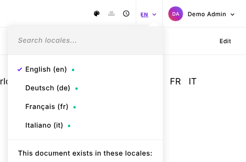
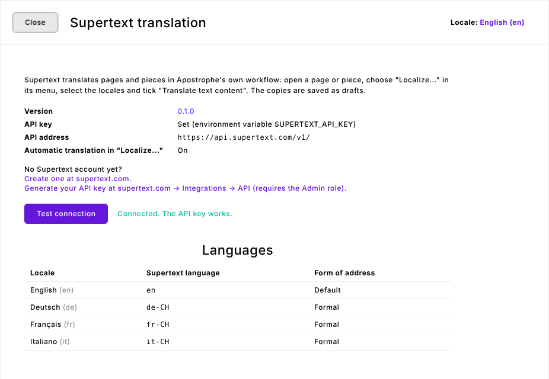

# Installation guide

For administrators: how to add Supertext Translation to an ApostropheCMS site, set up the API key and the languages, and what every setting does. Editors: see the [user guide](USER_GUIDE.md).

## What it does

The module registers Supertext as a **translation provider** for Apostrophe's own *Localize…* step (Apostrophe's `@apostrophecms/translation` module). When an editor localizes a page or piece into other locales and ticks **Translate text content**, every copy is translated by Supertext AI before Apostrophe saves it as a draft. Nothing else in the editing workflow changes. Administrators also get a **Supertext** status screen in the admin bar, and there are two command-line tasks (`check` and `translate`).

## Requirements

- ApostropheCMS 4.13 or later (tested with 4.33), with MongoDB, PostgreSQL or SQLite.
- Node.js 22.12 or later.
- At least two locales configured in `@apostrophecms/i18n` (see [Languages](#languages)).
- A Supertext account and an API key for the AI translation API:
  - No Supertext account yet? Create one at supertext.com: <https://www.supertext.com/person/en/account/signin>
  - Generate your API key at supertext.com → Integrations → API (requires the **Admin** role): <https://www.supertext.com/en/integrations/api>
- The server must reach `https://api.supertext.com` over HTTPS.

## Install

1. Add the package to your Apostrophe project:

   ```bash
   npm install supertext-apostrophe-translation
   ```

   (Until it is published on npm, install it from GitHub: `npm install github:Supertext/Apostrophe-Supertext-Translation`.)

2. Enable the module in `app.js`:

   ```js
   apostrophe({
     shortName: 'my-site',
     modules: {
       // …
       'supertext-apostrophe-translation': {
         options: {
           languages: {
             de: { code: 'de-CH', politeness: 'more' },
             fr: { code: 'fr-CH', politeness: 'more' }
           }
         }
       }
     }
   });
   ```

3. Set the API key as an environment variable (see [API key](#api-key)) and restart Apostrophe.

4. Rebuild the admin UI assets once (the module adds a Vue component and UI strings). In development Apostrophe does this on start; for production run your usual build, e.g. `node app @apostrophecms/asset:build` (or `npm run build` in the starter kits).

5. Check the connection:

   ```bash
   node app supertext-apostrophe-translation:check
   ```

   It prints the module version, the API address and `Connected. The API key works.` (No translation is made, so this costs nothing.)

## Update

```bash
npm update supertext-apostrophe-translation
```

Then rebuild the assets and restart. The version is shown on the Supertext status screen and by the `check` task. Read the [changelog](../CHANGELOG.md) before updating.

## Uninstall

Remove `'supertext-apostrophe-translation'` from `app.js`, run `npm uninstall supertext-apostrophe-translation`, rebuild the assets and restart. The module stores nothing in your database: localized documents it translated stay as they are.

## API key

The module reads the key from, in this order:

1. the environment variable `SUPERTEXT_API_KEY` (recommended: keeps the key out of your code), or
2. the module option `apiKey`.

Paste the key as Supertext shows it: with or without the `Supertext-Auth-Key ` prefix.

No Supertext account yet? Create one at supertext.com (<https://www.supertext.com/person/en/account/signin>). Generate your API key at supertext.com → Integrations → API (requires the Admin role): <https://www.supertext.com/en/integrations/api>.

Without a key, the module stays inactive: the *Translate text content* option doesn't appear in the *Localize…* wizard, the status screen says the key is missing, and Apostrophe logs a warning with both links when it starts.

## Languages

Apostrophe's locales are set in `modules/@apostrophecms/i18n/index.js` of your project. The module translates between all of them, from the locale the editor localizes from:

```js
// modules/@apostrophecms/i18n/index.js
export default {
  options: {
    defaultLocale: 'en',
    // Optional: slugs without accents (fabrique-a-la-main instead of fabriqué-à-la-main)
    stripUrlAccents: true,
    locales: {
      en: { label: 'English' },
      de: { label: 'Deutsch', prefix: '/de' },
      fr: { label: 'Français', prefix: '/fr' },
      it: { label: 'Italiano', prefix: '/it' }
    }
  }
};
```

By default the locale name is sent to Supertext as the language (`de`, `fr`, `pt_BR` → `pt-BR`). Use the `languages` option to send a regional variant or to choose the form of address:

```js
languages: {
  de: { code: 'de-CH', politeness: 'more' },   // Swiss German, formal (Sie)
  fr: { code: 'fr-CH', politeness: 'more' },   // Swiss French, formal (vous)
  'en-us': { code: 'en-US' }
}
```

The Supertext status screen lists every locale with the Supertext language and form of address it uses. Editors pick locales in the *Localize…* wizard:



## Settings

All settings are options of the `supertext-apostrophe-translation` module in `app.js`.

| Option | Default | Description |
| --- | --- | --- |
| `apiKey` | `''` | Supertext API key. The environment variable `SUPERTEXT_API_KEY` takes precedence. |
| `environment` | `'live'` | Supertext API environment: `live` (`https://api.supertext.com/v1/`), `staging` or `testing`. |
| `apiUrl` | `''` | Custom API address (overrides `environment`). The environment variable `SUPERTEXT_API_URL` takes precedence. Only for tests against a stand-in. |
| `languages` | `{}` | Per locale: `{ code, politeness }`. `code` is the Supertext language (e.g. `de-CH`); `politeness` is `more` (formal), `less` (informal) or left out (Supertext's default). |
| `translateSlugs` | `true` | New localizations get a slug made from the translated title (`/swiss-chocolate` → `/de/schweizer-schokolade…`). Re-translating keeps the slug the localized document already has. Set to `false` to keep Apostrophe's default (the source slug). |
| `skipWidgets` | `['@apostrophecms/html']` | Widget types that are never translated. |
| `timeout` | `180` | Seconds to wait for one translation before giving up. |
| `pollInterval` | `2` | Seconds between status checks while Supertext translates. |

To keep a field of your own schema out of translation, add `translate: false` to the field (see [what is translated](USER_GUIDE.md#what-is-translated)).

### Status screen

Administrators (users who may edit users, i.e. the *admin* role) see **Supertext** in the admin bar. It shows the module version (linked to its release notes), where the API key comes from, the API address, whether automatic translation is active in *Localize…*, the account and API key links, a **Test connection** button and the language table:



### Permissions

Translation follows Apostrophe's own permissions: whoever may localize a document (by default editors and administrators) gets the Supertext option in *Localize…*. Translated copies are always saved as drafts. The status screen and its API routes are for administrators only.

## Command-line tasks

```bash
# Version, API address and a free connection test
node app supertext-apostrophe-translation:check

# Localize a page into all other locales and translate it (drafts)
node app supertext-apostrophe-translation:translate --slug=/about

# A piece, only into German and French, replacing existing localizations
node app supertext-apostrophe-translation:translate --slug=handmade-in-bern --type=article --to=de,fr --overwrite
```

`translate` options: `--slug` (required), `--type` (for pieces), `--from` (source locale, default: the default locale), `--to` (comma-separated, default: all other locales), `--overwrite` (otherwise locales that already have the document are skipped).

## Troubleshooting

| Symptom | Cause and fix |
| --- | --- |
| *Translate text content* doesn't appear in *Localize…* | No API key: set `SUPERTEXT_API_KEY` and restart. The startup log says `[supertext] No Supertext API key`. Also check that the assets were rebuilt after installing. |
| *Authentication failed. Please check the Supertext API key.* | The key is wrong or was revoked. No Supertext account yet? Create one at <https://www.supertext.com/person/en/account/signin>. Generate your API key at supertext.com → Integrations → API (requires the Admin role): <https://www.supertext.com/en/integrations/api>. |
| *Too many requests* | Supertext limits requests per second. The module retries automatically up to four times; if it still fails, localize into fewer locales at once. |
| *Timed out waiting for the Supertext translation.* | Very long documents. Raise `timeout`. |
| *Your Supertext translation limit is exceeded.* | The account's quota is used up: upgrade the subscription at supertext.com. |
| *Could not reach Supertext: …* | The server can't reach `api.supertext.com` (firewall, proxy, DNS). |
| Some texts stay in the source language | The field type isn't translated (see the user guide) or the widget type is in `skipWidgets`. The log names texts Supertext returned nothing for. |
| The admin bar shows `supertext:menuLabel` instead of *Supertext* | The UI assets are out of date: rebuild them and restart. |

Errors are logged with the prefix `[supertext]` and shown to the editor as a notification.
