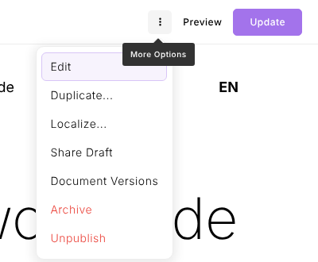
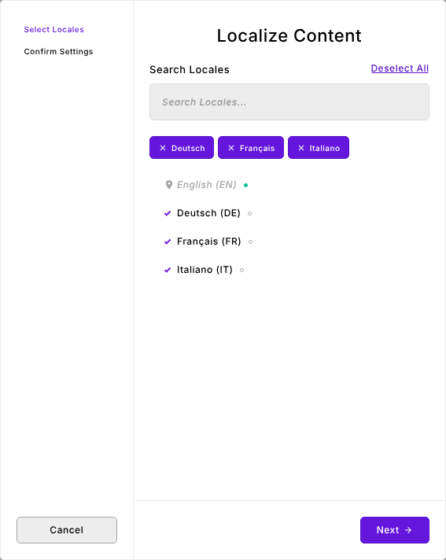
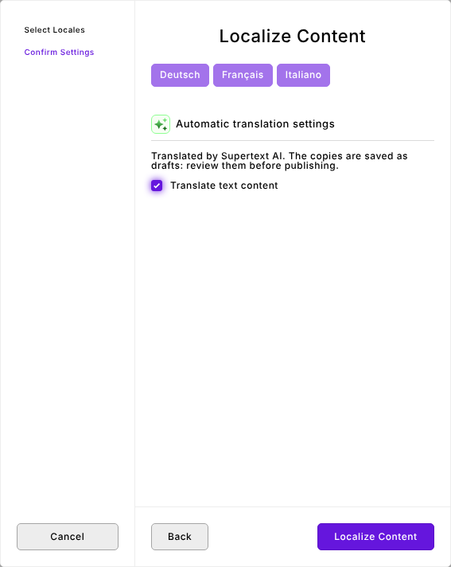
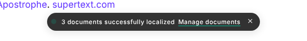
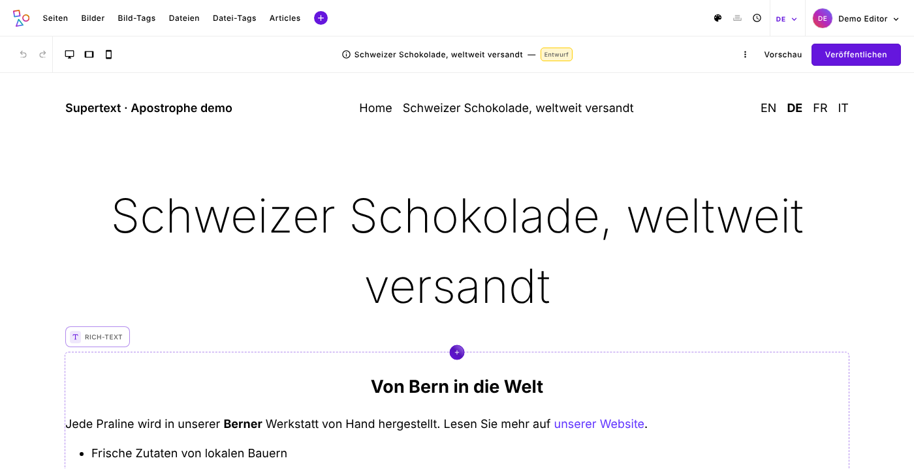
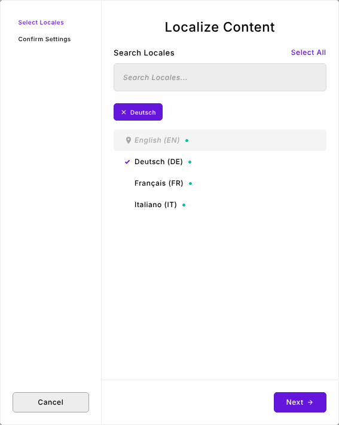

# User guide

For editors: how to translate pages and pieces with Supertext in ApostropheCMS, how to review the result, and what the messages mean. Administrators: see the [installation guide](INSTALLATION.md).

Supertext works inside Apostrophe's own **Localize…** step. There is no separate button: when the module is set up, the *Localize…* wizard has a **Translate text content** option, and the copies it creates in other languages are translated by Supertext AI.

## Translate a page or piece

1. Open the page (or the piece, e.g. an article) in the language you wrote it in, usually English. Save your changes first: Supertext translates the saved draft.
2. Open the **More Options** menu (⋮) in the admin bar (on a piece: in the editor's menu, or in the list) and choose **Localize…**.

   

3. Select the locales to translate into, or **Select All**. A filled dot next to a locale means the document already exists there.

   

4. Click **Next**. Under *Automatic translation settings*, tick **Translate text content**. (If you leave it unticked, Apostrophe copies the content without translating it, as usual.)

   

   If the page has related documents (images, linked pieces), Apostrophe's usual options for them appear here as well; related documents that Apostrophe localizes are translated too.

5. Click **Localize Content**. Translating takes a few seconds per language. When it's done, Apostrophe confirms it:

   

You can also translate several pieces at once: select them in the list, choose **Localize** from the batch actions, and tick *Translate text content* in the same way.

## Review and publish

The translations are saved as **drafts** in each locale; nothing is published automatically. Switch to the locale (the language menu in the admin bar, or the language links on the site), open the page and review it:

Edit anything you like, then **Publish** (or **Submit** if you are a contributor). A new localization also gets a translated URL, made from the translated title (e.g. `/de/schweizer-schokolade-weltweit-versandt`); you can change it in the page settings like any slug.

## Translate again

Localizing into a locale where the document already exists **replaces that draft** with a new copy of the source, translated again. Apostrophe doesn't ask for confirmation: the filled dot in the locale list is the only sign that a version exists.

Unpublished changes you made in the translated draft are lost; the published version stays as it is until you publish again. The URL of an existing localization is kept.

## What is translated

- The **title** and other text fields (including multi-line text fields such as summaries).
- **Rich text**: each paragraph, heading, list item, quote and table cell is translated as a whole, with bold, italics and links kept in place. Link targets are not changed.
- Text fields of **other widgets** (for example a heading or caption field of your site's own widgets) and of **arrays and object fields**, at any depth, including widgets in layout columns.
- The **URL slug** of a new localization (see above).

## What is not translated

- Choices, dates, numbers, links (URL fields), e-mail fields, colors, tags and relationships: these are copied as they are.
- **HTML widgets** (raw code) and any widget type your administrator excluded.
- Fields your developers marked as not translatable (`translate: false`), e.g. product codes.
- Images and files themselves. Their own titles and alt texts are translated when Apostrophe localizes them as related documents with *Translate text content* ticked.
- Text that is part of the site's templates (header, footer, buttons): that is translated by your developers, not in the content.

## Messages

| Message | Meaning |
| --- | --- |
| *Supertext could not translate "…" into …: Authentication failed. Please check the Supertext API key.* | The site's Supertext API key is wrong or missing. Ask your administrator. |
| *… Too many requests to Supertext. Please try again shortly.* | Supertext is busy with your account's requests. Wait a moment and localize again, into fewer languages at once. |
| *… Your Supertext translation limit is exceeded.* | The Supertext account's quota is used up. Ask your administrator. |
| *… Timed out waiting for the Supertext translation.* | The document is very long. Try again later or ask your administrator to raise the time limit. |
| *… Could not reach Supertext* | The site can't connect to Supertext right now. Try again later. |
| No *Translate text content* option in the wizard | The module isn't set up (no API key). Ask your administrator. |

When translating into one language fails, the other languages are still translated. Apostrophe then shows a report of the locales that failed; those get no new copy. Localize into them again once the problem is solved.
